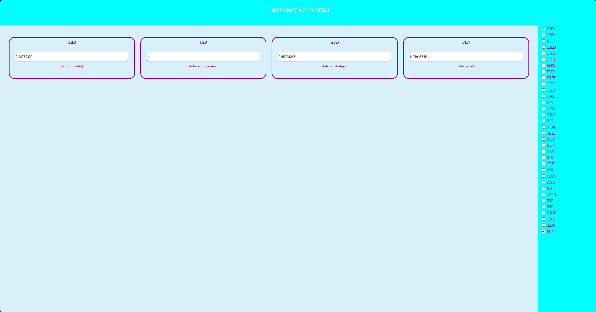
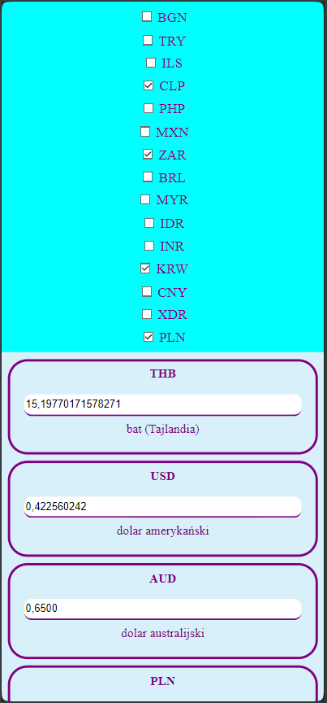
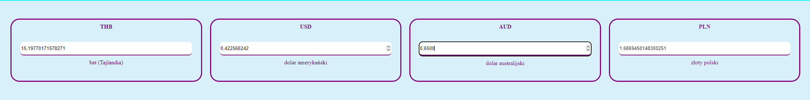

# ConverterFrontend, SOFTTECO Task
***
Frontend for currency converter created in Vue.js

## Description
***
Created basic currency converter application frontend.

## Technologies used
***
To create backend, I used:
* git
* HTML
* CSS
* Vue.js
* Vite

# Screenshots gallery
***

## You can decide which currencies are visible using right side of the page.
***


```
Using checkbox select which currencies you want to see on your screen. After adding new currency - it's added with recalucalted value!
```

## There's also responsive mobile version of the site
***



```
It's only a fragment of whole site and it's fully scrollable.
```

## All data are fetched from server in real-time
***



```
You don't have to click outside the input filed or accept it using some kind of button - just type the amount! 
```